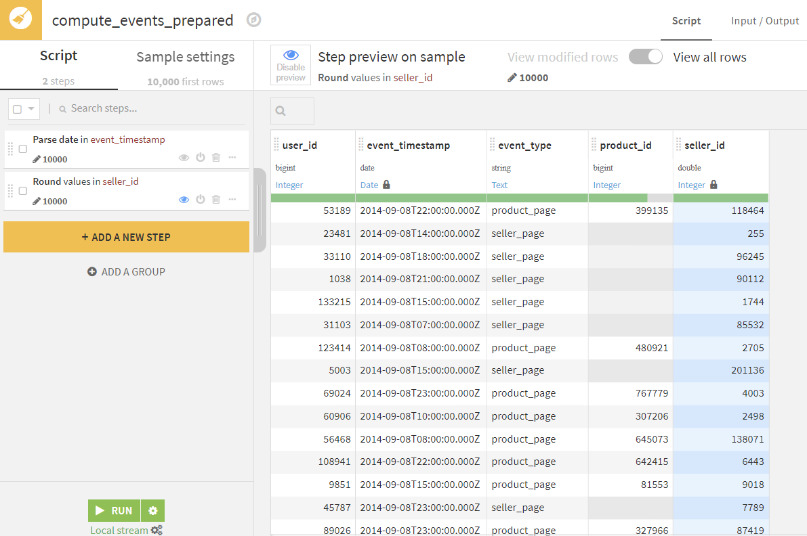
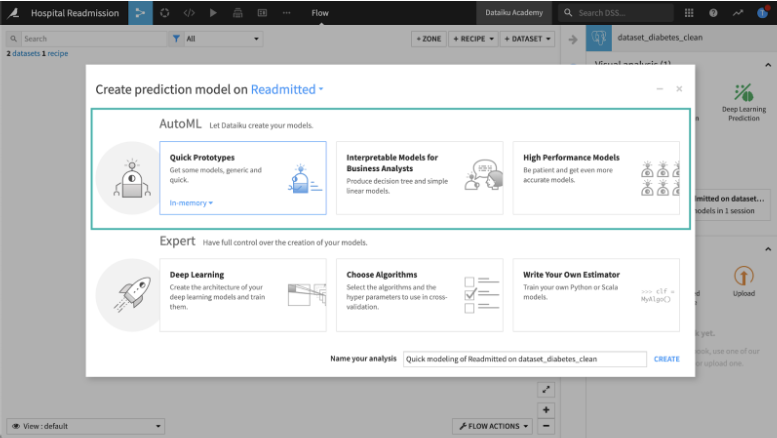
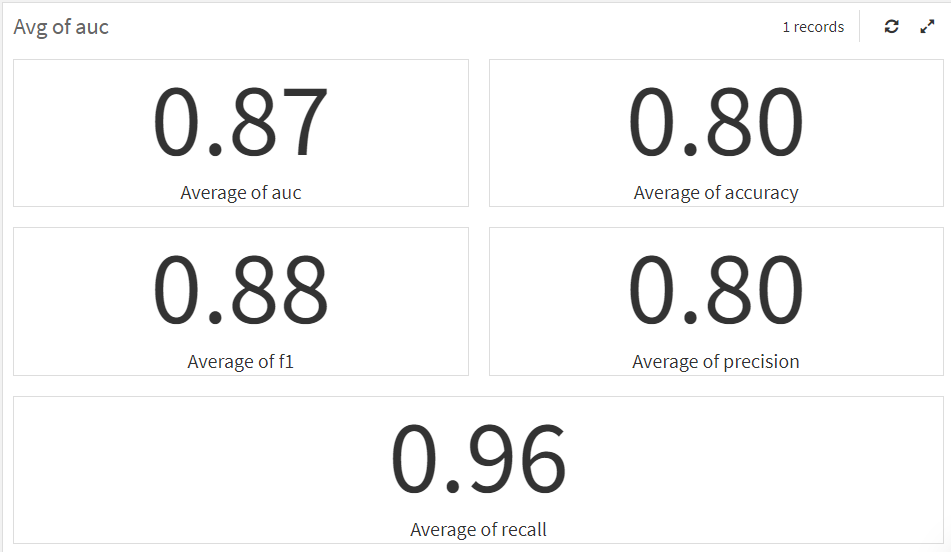

# Simplify AI with Dataiku

Project Team: Balvinder Singh Uppal, Divyansh Tripathi, Caitlyn Yen, Elsa Yen, Sai Pranit Srivatsa Valluru, Sherry Zheng                                   
Project Video: https://www.youtube.com/watch?v=GA7SeSu2GjY 
 
## Why Dataiku?
 
Dataiku is the platform for Everyday AI, systemizing the use of data for exceptional business results. Using AI at different levels has become essential hence opting for an easy one-stop shop platform like Dataiku is essential.
 
Dataiku has capabilities to streamline the path to production AI and can help different teams in the organization to manage and govern AI projects at scale.
 
 
## End-to-End Machine Learning Lifecycle Process
 
Dataiku, through the means of its DSS (Data Science Studio) platform, tries to span the needs of data scientists, data engineers, business analysts, and AI consumers. In addition, Dataiku DSS tries to span the machine learning process from end to end, i.e. from data preparation through MLOps and application support.
The Dataiku DSS user interface is a combination of graphical elements, notebooks, and code. As a user, one often has a choice of how you’d like to proceed, and you’re usually not locked into your initial choice, given that graphical choices can generate editable notebooks and scripts.

DSS would support a standard ML workflow in the following manner –
The Flow begins with two flow zones, one for Data Preparation and one for Model assessment. 

### Data Preparation
The Data preparation Flow Zone contains the input datasets for example a web-based marketplace has two datasets - Events and Products. The data is first ingested to DSS in the right format from its respective data sources like a flat file, CSV, or database. After the data ingestion, it would mean just importing your CSV or parquet file into the project and preparing data by inspection of columns, datatypes, cleaning, and imputing null values.

### Analyze the Data
The first step of a data science project is to explore the data and this can be done by using the Analyze in the drop-down menu by using a PostgreSQL sync recipe. In the quick start, you can also perform some feature engineering.

### Defining the problem and creating the target
When building a prediction model, a critical step is to define your particular problem, and determine how it can be translated into a variable that can be used in a machine-learning model. The definition of the target variable is totally dependent on your business model and can differ widely from one business problem to another.

Once you’ve identified the target variable, you will be able to select between AutoML and Expert mode. With AutoML or Automated Machine Learning mode, Dataiku DSS will make a lot of optimized choices for you. With Expert mode, you can use deep learning models, have full control over the details of your model, or write your own algorithms. For example, when building a prediction model, you can select an AutoML task, such as Quick Prototypes, to let DSS make smart modeling choices like the train/test split or the preprocessing of features.

### Building a first model
Once the target variable is built, we need to create the complete training set that will store a list of the required features. The features are the variables we’ll use to try to predict the target variable.
Similarly, a testing set that stores the target variable for checking the predictions is created.

### Model Assessment
The Model assessment Flow Zone contains the target_feedback dataset and the test data along with their true labels. This dataset will be used for evaluating the true test performance of the ML model. Multiple machine learning models can be created for the same target variable to perform predictions and select the best-performing model.

After selecting the different models, each machine learning algorithm has some settings, called hyperparameters where you can ask DSS to explore several values for each hyperparameter or several hyperparameters, all the combinations of values will be assessed in a “grid search”.

 
### Deploying the model
Once the model is created and trained, DSS will now train the models on the train set, and evaluate it using an auxiliary test set. The summary model list should now be updated with new runs if required.

Once the model is deployed and run it will include and save all the parameters, the dataset, features, and algorithms used during training, as well as relevant training information which can be used to create many training sessions to experiment and try to improve your baseline or best model’s performance.

### Bibliography and Credits

https://www.dataiku.com/

https://community.dataiku.com/

https://academy.dataiku.com/
